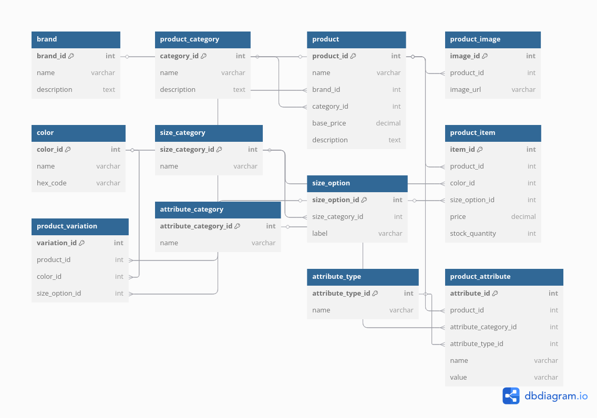

# E-commerce Database Design

## 🎯 Project Overview

This project focuses on creating the backend database design for an e-commerce platform. The goal is to model an e-commerce system by defining various entities (tables), their relationships, and constraints. The database will be structured to support features like product listings, categories, product variations, and more.

The project includes an **Entity-Relationship Diagram (ERD)**, **SQL scripts** for creating the database tables, and an explanation of **data flow** between entities.

## 🛠️ Key Features

- **Entities**: Defines tables such as `product`, `product_category`, `product_variation`, `product_attribute`, etc.
- **Relationships**: Establishes relationships between entities using foreign keys, ensuring data consistency and integrity.
- **SQL Scripts**: The `ecommerce.sql` file contains all the necessary `CREATE TABLE` statements for the database schema.
- **Data Flow Documentation**: A section that maps how data flows between tables for various e-commerce operations.

## 📊 ERD (Entity-Relationship Diagram)

The **Entity-Relationship Diagram (ERD)** visually represents the structure of the e-commerce database, displaying entities and their relationships. The ERD is available in the `erd/` directory.

Below is the diagram showing the structure of the e-commerce database:


## 🗂️ Project Structure

Here’s how the project is organized:

```
ecommerce-database/
│
├── README.md                  # Project overview and instructions
├── LICENSE                    # (Optional) Open-source license
├── erd/
│   └── ecommerce_db.drawio    # ERD diagram (you can also export to .png or .pdf)
│
├── sql/
│   ├── ecommerce.sql          # Contains CREATE TABLE statements and test data
│   └── sample_queries.sql     # Optional: common queries like search/filter
│
├── docs/
│   └── data_flow.md           # Explanation of data flow and relationships
│
└── .gitignore                 # (Optional) To ignore backups or temp files
```

## 🔄 Data Flow

The data flow between tables ensures that our e-commerce platform can function efficiently. Here’s a summary of how data is structured and managed:

- **Products and Categories**: The `product` table is connected to the `product_category` table, allowing each product to be associated with a category (e.g., clothing, electronics).
- **Product Variations**: The `product_variation` table links products to specific variations (e.g., color, size). Each variation is uniquely identified.
- **Attributes and Types**: The `product_attribute` table stores custom attributes for products (e.g., material, weight), and the `attribute_type` defines how those attributes are stored (e.g., text, number).
  
Detailed data flow is documented in the `docs/data_flow.md` file.

## 🚀 Getting Started

To set up the database, follow these steps:

1. Clone the repository:
   ```bash
   git clone https://github.com/<your-username>/ecommerce-database.git
   cd ecommerce-database
   ```

2. Install MySQL or PostgreSQL locally (if not already installed).

3. Run the SQL script to create the database schema:
   ```bash
   mysql -u root -p < sql/ecommerce.sql
   ```

4. Optionally, explore or modify the database using any SQL client (e.g., MySQL Workbench).

## 📑 Sample Queries

You can find sample SQL queries (such as searching for products, filtering by category, etc.) in the `sql/sample_queries.sql` file.

## 📚 Data Flow Documentation

The `docs/data_flow.md` file provides a comprehensive explanation of how data flows between tables in the database. This document includes example workflows, like how data moves when a customer purchases an item or when a product is updated.

---

## 💬 Collaboration & Contributions

This project was designed individually as part of an e-commerce database assignment. If you'd like to contribute, feel free to fork the repo, create a pull request, or provide feedback.

---

## 📜 License

This project is licensed under the MIT License - see the [LICENSE](./LICENSE) file for details.
```

### How to Use:
1. Create a file named `README.md` in the root of your repository.
2. Copy and paste the above code into the file.
3. Replace `<your-username>` with your actual GitHub username.
